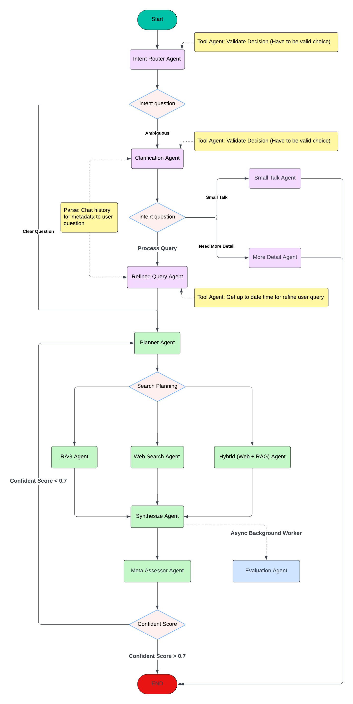
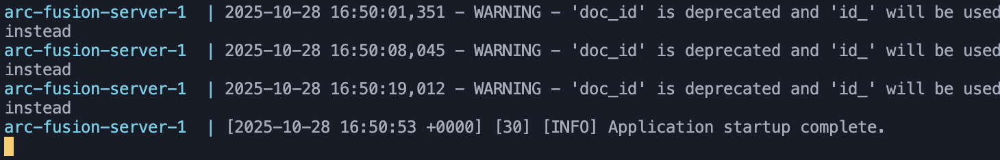

# 🚀 ArcFusion - Intelligent Multi-Agent Chatbot LLM System

ArcFusion is an advanced multi-agent LLM system built with LangGraph that intelligently routes user queries through specialized agents, performs autonomous retrieval (RAG, Web Search, or Hybrid), and synthesizes high-quality responses with self-assessment and replanning capabilities.

## 🏛️ Architecture Overview

### System Architecture Diagram


## 🤖 Agent Descriptions

### Clarification Agents

#### 1. InitRouterAgent
- **Purpose**: Initial entry point that classifies user queries
- **Decisions**: Routes to `clear_question` (directly to Planner) or `ambiguous` (to Clarification)
- **Implementation**: ReAct agent with routing tool

#### 2. ClarificationAgent
- **Purpose**: Analyzes ambiguous queries to determine appropriate handling
- **Decisions**: Routes to SmallTalk, NeedsMoreDetail, or RefinedQuery
- **Implementation**: ReAct agent with classification tools

#### 3. SmallTalkAgent
- **Purpose**: Handles casual conversation and greetings
- **Action**: Provides friendly responses and terminates workflow

#### 4. MoreDetailAgent
- **Purpose**: Requests additional information from users for vague queries
- **Action**: Asks clarifying questions and terminates workflow

#### 5. RefinedQueryAgent
- **Purpose**: Transforms clarified queries into optimized search queries
- **Action**: Enhances query clarity and passes to Planner

### Autonomous Orchestration Agents

#### 6. PlannerAgent
- **Purpose**: Autonomously selects optimal retrieval tool and generates search queries
- **Tools Available**: `rag_search`, `web_search`, `hybrid_search`
- **Output**: Selected tool + optimized query/queries
- **Replanning**: Can be invoked multiple times if Meta-Assessor deems quality insufficient

#### 7. RAGRetrievalAgent
- **Purpose**: Retrieves information from internal vector database (ChromaDB)
- **Strategy**: Semantic search over ingested PDF documents
- **Best For**: Technical questions, paper-specific information

#### 8. WebSearchAgent
- **Purpose**: Retrieves information from external web sources
- **Strategy**: Web search with result extraction
- **Best For**: Current events, biographical information, recent developments

#### 9. HybridRetrievalAgent
- **Purpose**: Executes RAG and Web Search in parallel
- **Strategy**: Combines internal and external information sources
- **Best For**: Complex queries requiring comprehensive context

#### 10. SynthesizerAgent
- **Purpose**: Generates final answers from retrieved information
- **Features**: 
  - Context-aware prompts for RAG, Web, or combined sources
  - Structured response formatting
  - Citation of sources
- **Output**: Comprehensive, well-formatted answer

#### 11. MetaAssessorAgent
- **Purpose**: Evaluates answer quality and triggers replanning if needed
- **Metrics**: 
  - Confidence score (0.0 to 1.0)
  - Quality reasoning
- **Decisions**: 
  - High confidence (≥0.7): END workflow
  - Low confidence (<0.7): Trigger replanning (up to 3 attempts)
- **Prevents**: Hallucinations and low-quality responses

### Evaluation Agents

#### 12. EvaluationAgent
- **Purpose**: Performs comprehensive quality evaluation and analytics (runs asynchronously in background)
- **Execution**: Triggered by Synthesizer after response generation, non-blocking
- **Evaluation Metrics**:
  - **Faithfulness** (RAG): Verifies answer is supported by retrieved documents
  - **Factual Consistency** (Web): Ensures answer aligns with web sources
  - **Answer Relevance**: Confirms answer addresses user's question
  - **Context Precision** (RAG): Assesses if retrieved context is focused
  - **Retrieval Quality**: Quantitative score based on document similarity scores
  - **Semantic Relevance**: Embedding-based similarity between query and results
- **Dynamic Evaluation**: Adapts evaluation strategy based on tool type (RAG/Web/Hybrid)
- **Confidence Calculation**: Weighted combination of all metrics for comprehensive quality score
- **Database Persistence**: Saves evaluation metrics for analytics, monitoring, and continuous improvement
- **Note**: Separate from MetaAssessorAgent; runs in background for analytics while MetaAssessor drives workflow decisions

## 🚀 How to Run Locally

### Prerequisites

- Docker and Docker Compose installed
- At least 4GB of available RAM
- OpenAI API key (or other LLM provider key)

### Setup Steps

1. **Clone the repository**
```bash
git clone https://github.com/guncv/ArcFusion-Assignment.git
cd ArcFusion-Assignment
```

2. **Create environment file**

Create a `.env` file in the project root with your configuration:

```env
# LLM Configuration
OPENAI_API_KEY=your_openai_api_key_here
TAVILY_API_KEY=your_tavily_api_key
# Application Configuration
ENV=dev

# Database Configuration (matches docker-compose.yaml)
POSTGRES_USER=arcfusion
POSTGRES_PASSWORD=arcfusion_dev_password
POSTGRES_DB=arcfusion
POSTGRES_HOST=postgres
POSTGRES_PORT=5432

# LangSmith for tracing
LANGCHAIN_TRACING_V2=true
LANGCHAIN_ENDPOINT=https://eu.api.smith.langchain.com
LANGCHAIN_API_KEY="your_langsmith_key"
LANGCHAIN_PROJECT=arcfusion-dev
```

3. **Build and run with Docker Compose**

```bash
# Build and start all services
docker compose up --build

# Or use the Makefile
make build
make run
```

The services will start:
- **API Server**: http://localhost:8000
- **PostgreSQL**: localhost:5432

4. **Wait server for ingestion**



5. **Test the API**

| Endpoint | Method | Request | Response |
|----------|--------|---------|----------|
| **Chat with LLM** | `POST /api/v1/llm/` | ```"user_input": "What did OpenAI release this month?"``` | ```In October 2025, OpenAI made several significant releases and announcements``` |
| **Clear Chat History** | `POST /api/v1/llm/clear-history` | ```-``` | ```"message": "Chat history cleared successfully"``` |
| **Health Check** | `GET /api/v1/llm/health-check` | ```-``` | ```"status": "ok"``` |

### Stopping the Application

```bash
# Stop services
docker compose down

# Or using Makefile
make down

# Clean everything (including volumes)
make clean
```

## 🔮 Future Improvements

### 1. RAG System Optimization (High Priority)
- **Replace Ingestion Method**: Currently using LlamaIndex's UnstructuredReader with Java dependencies. Should to replace with a lighter, more efficient alternative like **PyPDF2** or **pypdf** for basic PDF extraction, or use **LangChain's PyPDFLoader** which doesn't require Java
- **Rethink Chunking Strategy**: Current LlamaIndex SemanticSplitterNodeParser is overkill and resource-intensive. Should migrate to simpler chunking:
  - **LangChain RecursiveCharacterTextSplitter** with fixed chunk size (e.g., 500-1000 chars) and overlap
  - **Semantic chunking** alternatives like **NLTK sentence tokenization + similarity-based grouping**
- **Simplify Dependency Chain**: Remove heavy Unstructured.io + LlamaIndex stack. Use direct LangChain document loaders + splitters for better performance and lower costs
- **Find the Right Balance**: Focus on practical efficiency - current setup is too complex for the use case. Simpler = faster = cheaper

### 2. Prompt Optimization (Medium Priority)
- **Reduce Prompt Length**: Current prompts may be verbose. Refactor to be shorter while maintaining clarity and effectiveness
- **Tailor to Agent Use Cases**: Each agent should have prompts optimized specifically for its role - remove generic instructions and focus on what matters
- **Cost Reduction**: Shorter prompts = lower token usage = reduced LLM costs across all 12 agents
- **Implement Prompt Templates**: Create concise, reusable templates that can be version-controlled and A/B tested

### 3. Chat History & Performance (Low Priority)
- **Add Redis Caching**: Move chat history from PostgreSQL-only to hybrid Redis + PostgreSQL for faster retrieval
- **Benefits**: Redis provides sub-millisecond access times for active conversations, PostgreSQL for long-term persistence
- **Implementation**: Use Redis for hot data (recent sessions), PostgreSQL for cold data and analytics
- **Reduce Database Load**: Lighten PostgreSQL workload by serving frequently accessed data from memory

## 📦 Docker Files Included

This repository includes all necessary Docker configuration:

- **Dockerfile**: Multi-stage build using Micromamba for Python environment
  - System dependencies for PDF processing (poppler, tesseract)
  - Java 17 for LlamaIndex document readers
  - Production-ready with Gunicorn

- **docker-compose.yaml**: Complete orchestration
  - API server (FastAPI + Gunicorn)
  - PostgreSQL database with persistent volume
  - Health checks and dependency management
  - Environment variable configuration

- **gunicorn.conf.py**: Production WSGI configuration
  - Worker configuration
  - Logging setup
  - Performance tuning